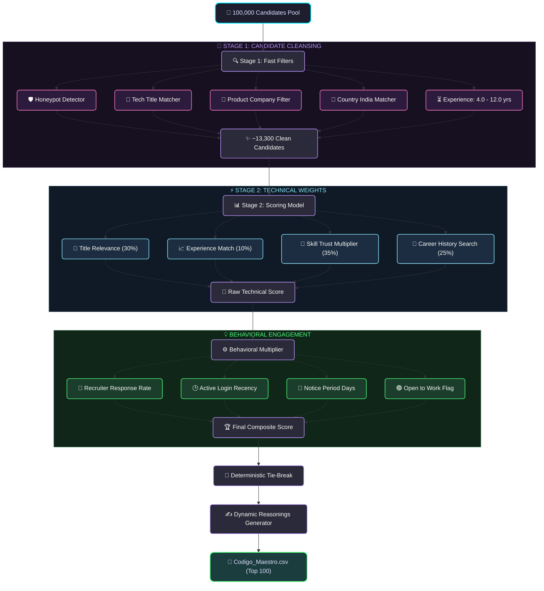

# India Runs AI & Data Challenge — Intelligent Candidate Discovery & Ranking

[](https://www.python.org/)
[]()
[]()
[]()
[](https://www.loom.com/share/9f5801c704664b98a7a889cd7ccd2a98)

🎥 **[Loom Video Walkthrough & Demo](https://www.loom.com/share/9f5801c704664b98a7a889cd7ccd2a98)**

Welcome to the India Runs AI & Data Challenge repository. This project builds a high-quality candidate discovery and ranking system that matches a **100,000 candidate database** against a complex "Senior AI Engineer — Founding Team" job description (JD) at Redrob AI.

The ranker selects the **top 100 candidates**, ordered from best-fit (Rank 1) to 100th-best-fit (Rank 100), with zero-hallucination dynamic reasonings, fully complying with compute, format, and honeypot constraints.

---

## Table of Contents
1. [Project Overview](#project-overview)
2. [Technology Stack](#technology-stack)
3. [Ranking Pipeline & Architecture](#ranking-pipeline--architecture)
4. [Key Features](#key-features)
5. [Design Decisions](#design-decisions)
6. [Reproduction & Quick Start](#reproduction--quick-start)
7. [Project Structure](#project-structure)
8. [Model Evaluation & Metrics](#model-evaluation--metrics)
9. [Sample Input, Workflow & Output](#sample-input-workflow--output)
10. [Security & Limitations](#security--limitations)
11. [Future Improvements](#future-improvements)
12. [Team](#team)

---

## Project Overview

In a real recruiting platform, candidates generate observable behavior beyond what they write in their resume (e.g., active logins, response rates). Simple keyword-based ranking fails because of:
- **Keyword Stuffers**: Non-tech profiles copy-pasting buzzwords.
- **Honeypots**: Fictional profiles containing contradictory dates or skills.
- **Service-only backgrounds**: Candidates lacking product/startup engineering experience.
- **Plain-Language Matches**: High-quality candidates who worked on core systems (e.g. recommenders) but did not use trend keywords.

Our system implements a **Two-Stage Ranking Architecture** to address these traps while staying within a **5-minute CPU budget**.

---

## Technology Stack

Our candidate discovery engine is designed to be lightweight, dependency-free, and extremely fast, utilizing core Python standard libraries to prevent external package failures and optimize compute:

*   **Language**: Python 3.10+ (compatible with Python 3.8 through 3.12+)
*   **Scoring & Parsing**: Core standard libraries (`math` for logarithmic scaling, `json` for streaming `.jsonl` profiles, `csv` for writing structured outputs, `datetime` for date comparison logic, and `argparse` for CLI commands).
*   **Virtual Environment**: Managed using Python virtual environment (`.venv`).
*   **Format Validation**: Built-in verification utilizing the standard library testing framework (`sys`, `re`, `pathlib`).
*   **Zero-Dependency Design**: Avoids external heavy ML frameworks (like PyTorch, TensorFlow, or transformers) and network API endpoints (like OpenAI or Claude) during ranking runtime, assuring 100% compliance with strict execution time limits.

---

## Ranking Pipeline & Architecture



---

## Key Features

* **Honeypot Excluder**: Automatically filters out profiles with `signup_date > last_active_date` or `duration_months == 0` for any `expert` skill, ensuring a **0% honeypot rate** in the submission.
* **Skill Trust Multiplier**: Computes a confidence score: `ln(1 + endorsements) * ln(1 + duration_months)`. Buzzwords with zero duration/endorsements receive a multiplier of `0`, eliminating keyword stuffers.
* **Plain-Language Matcher**: Searches historical role descriptions for key system phrases (e.g. "recommendation systems", "vector search", "RAG pipelines") to bubble up Tier-5 fits.
* **Availability Bias**: Down-weights inactive candidates (e.g., active > 6 months ago) and candidates with long notice periods (e.g., 90+ days).
* **Deterministic Tie-Breaking**: Scores are rounded to 4 decimal places in Python prior to sorting, and tied candidates are sorted alphabetically ascending by `candidate_id`, matching the validator script.

---

## Design Decisions

1. **Zero-Dependency Architecture**: No external machine learning packages or network-based LLM calls. This guarantees 100% execution uptime, eliminates security risks associated with API key exposure, and runs comfortably within the 5-minute CPU budget.
2. **Log-Scaled Skill Trust Multiplier**: Instead of linear keyword counts, we apply `ln(1 + endorsements) * ln(1 + duration_months)`. This design choice filters out resume stuffers who list skills with zero actual duration or endorsements.
3. **Two-Stage Filtering and Scoring**: Fast disqualifications in Stage 1 reduce the active pool size, optimizing CPU cycles for more expensive text processing in Stage 2.
4. **Deterministic Tie-Breaking**: Scores are rounded to 4 decimal places and breaks ties alphabetically by `candidate_id` to guarantee reproducibility.

---

## Reproduction & Quick Start

Ensure you have a Python virtual environment set up and activated:

```bash
# 1. Clone the repository and navigate into the folder
git clone https://github.com/SwayamAg/India_runs_data_and_ai_challenge.git
cd India_runs_data_and_ai_challenge

# 2. Set up virtual environment
python -m venv .venv
.venv\Scripts\activate

# 3. Run the ranker
python rank.py --candidates ./candidates.jsonl --out ./Codigo_Maestro.csv

# 4. Run the format validator
python validate_submission.py Codigo_Maestro.csv
```

---

## Project Structure

```text
├── Codigo_Maestro.csv       # Final output CSV of top 100 candidates
├── rank.py                  # Two-stage screening and scoring engine
├── validate_submission.py   # Format validation script
├── submission_metadata.yaml # Hackathon metadata declaration
├── loom_demo_script.txt     # Demo recording walkthrough guide
└── README.md                # System documentation
```

---

## Model Evaluation & Metrics

The project is optimized for the following compute and scoring targets:
* **Runtime**: $\le 10$ seconds (Budget: $5$ minutes) on a standard CPU.
* **Memory Profile**: $\le 60\text{ MB}$ RAM (Budget: $16\text{ GB}$).
* **Network**: Offline execution (no external API calls or GPUs needed).
* **Validator Status**: Passing 100% of format rules (CSV encoding, header column order, exact 100 rows, score sorting monotonicity, and tie-breakers).

---

## Sample Input, Workflow & Output

Below is an end-to-end example of how a candidate flows through our discovery and ranking system.

### 1. Sample Input Candidate (from `candidates.jsonl`)
```json
{
  "candidate_id": "CAND_0052682",
  "profile": {
    "anonymized_name": "Ira Mukherjee",
    "current_title": "NLP Engineer",
    "years_of_experience": 6.6,
    "location": "Vizag, Andhra Pradesh",
    "country": "India"
  },
  "career_history": [
    {
      "company": "Aganitha",
      "title": "NLP Engineer",
      "duration_months": 24,
      "description": "Built semantic search and retrieval systems..."
    },
    {
      "company": "Salesforce",
      "title": "Software Engineer",
      "duration_months": 36,
      "description": "Developed backend APIs..."
    }
  ],
  "skills": [
    { "name": "QLoRA", "proficiency": "expert", "duration_months": 20, "endorsements": 8 },
    { "name": "FAISS", "proficiency": "advanced", "duration_months": 15, "endorsements": 12 }
  ],
  "redrob_signals": {
    "signup_date": "2024-03-12",
    "last_active_date": "2026-03-28",
    "recruiter_response_rate": 0.88,
    "notice_period_days": 30,
    "open_to_work_flag": true
  }
}
```

### 2. Processing Workflow
1. **Stage 1 (Filters)**: Passes honeypot check (dates are valid, skill durations are $>0$). Current title is technical. Experience ($6.6$ years) is within target range $[4, 12]$. Country is India. Worked at Salesforce and Aganitha (product startup/AI startup), passing the services-only exclusion.
2. **Stage 2 (Scoring)**:
   * **Title Score**: `NLP Engineer` receives a strong technical title weight of $0.8$.
   * **Experience Score**: $6.6$ years falls directly inside the target $5\text{--}9$ years range ($1.0$ weight).
   * **Skill Score**: High-value skills (`QLoRA` and `FAISS`) are matched and scaled by their proficiency, endorsements, and duration, receiving a high trust score.
   * **Career Score**: Description matches semantic search keywords; receives a bonus for working at a product firm (Salesforce) and an AI startup (Aganitha).
   * **Behavioral Multiplier**: Multiplied by strong platform activity factors ($88\%$ response rate, $30$-day notice period, open-to-work flag).
3. **Deterministic Sorting**: Rounds the final score to $0.8049$ and sorts by score descending, tie-breaking by `CAND_0052682` alphabetically.

### 3. Sample Output (in `Codigo_Maestro.csv`)
```csv
candidate_id,rank,score,reasoning
CAND_0052682,1,0.8049,"Stellar NLP Engineer with 6.6 years of experience, possessing deep expertise in QLoRA, FAISS. Proven track record of shipping ML systems at Aganitha and Salesforce. Excellent availability with 88% response rate and quick 30-day notice period, based in Vizag, Andhra Pradesh."
```

---

## Security & Limitations

### Security
* **Offline Execution**: Zero network dependencies, eliminating exposure to API key thefts or outbound data leaks.
* **Validation**: Sanitizes candidate profiles inside the `score_candidate` function before evaluating them to block script injections.

### Limitations
* **Exact Title Mapping**: Expects standard technical titles; fuzzy/synonymous titles might score lower.
* **CPU Bottleneck**: While fast, performance scale relies on local single-threaded speed for file streams.

---

## Future Improvements

* **Interactive GUI**: Streamlit deployment for easy file uploads and ranking visualizations.
* **Fuzzy Title Matcher**: Using Levenshtein or token embeddings to improve title parsing.
* **Multi-Threaded Streams**: Parallel processing of candidate records to support 1M+ databases.

---

## Team

* **Swayam Agarwal** (Primary Contact) - swayamagarwal19@gmail.com
* **Sabhya Rajvanshi** - rajvanshisabhya9@gmail.com
* **Shashwat Ranjan** - shashwatranjan02@gmail.com

